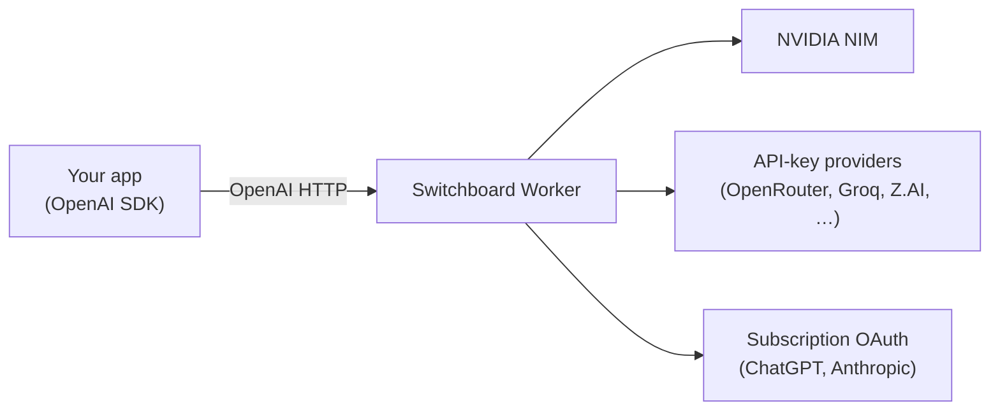
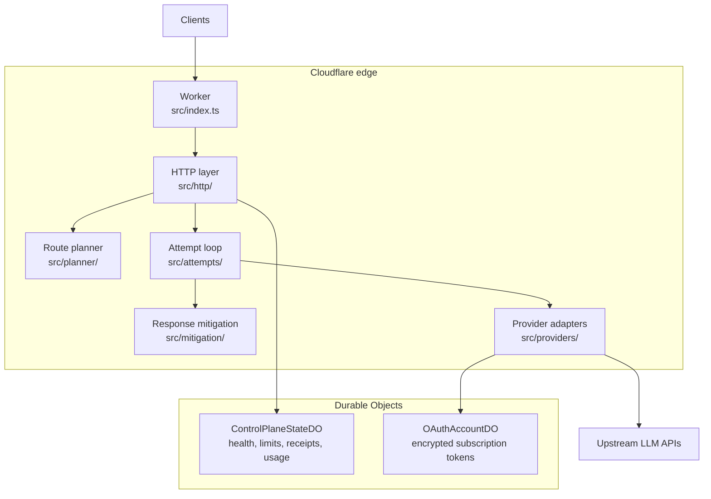
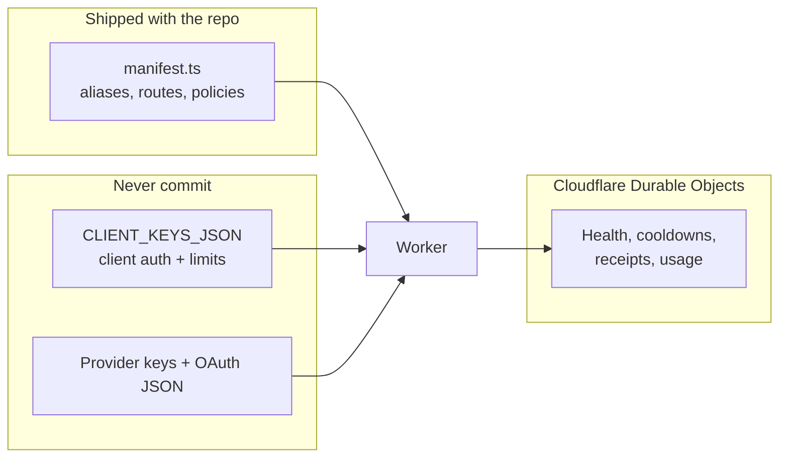

# Switchboard

**One OpenAI-compatible API in front of many LLM backends.**

Switchboard is a [Cloudflare Worker](https://developers.cloudflare.com/workers/) that sits between your application and upstream model providers. Your code keeps using the familiar OpenAI SDK and HTTP paths (`/v1/chat/completions`, `/v1/models`, and related routes). Switchboard handles authentication, picks a healthy backend, retries and fails over when something breaks, and returns a normal OpenAI-shaped response.

You get a single base URL and a single API key model for clients, while operators can route traffic across NVIDIA NIM, API-key hosts, and subscription OAuth backends without changing application code for every provider swap.

Deployed Worker name: **`llm-control-plane`** (see [`wrangler.jsonc`](wrangler.jsonc)).

---

## Table of contents

- [The problem Switchboard solves](#the-problem-switchboard-solves)
- [Who this is for](#who-this-is-for)
- [How it works in plain terms](#how-it-works-in-plain-terms)
- [Architecture](#architecture)
- [Core concepts](#core-concepts)
- [What happens on one request](#what happens-on-one-request)
- [Main capabilities](#main-capabilities)
- [Quick start](#quick-start)
- [Use with OpenAI SDKs](#use-with-openai-sdks)
- [HTTP API overview](#http-api-overview)
- [Configuration (three layers)](#configuration-three-layers)
- [Development commands](#development-commands)
- [Repository layout](#repository-layout)
- [Documentation](#documentation)
- [License](#license)

---

## The problem Switchboard solves

Modern apps rarely talk to just one LLM vendor. Teams mix hosted APIs, NVIDIA NIM, free-tier catalogs, and subscription accounts (ChatGPT, Claude, and similar). Each backend has different URLs, auth schemes, failure modes, and response quirks.

Without a control plane, every app must:

- Hard-code provider URLs and keys
- Implement its own retries and failover
- Rebuild rate limiting and observability per service
- Patch client libraries when a backend changes shape

**Switchboard centralizes that work.** Applications see one stable OpenAI-compatible surface. Operators define routing, limits, and secrets in configuration and deploy a single Worker at the edge.

---

## Who this is for

| Audience | What you get |
|----------|----------------|
| **Application developers** | Point `OPENAI_BASE_URL` at Switchboard; use normal model names and SDKs. |
| **Platform / infra operators** | Edit routing in code, rotate provider secrets, inspect health, receipts, and usage. |
| **Teams running multiple models** | Per-client and per-team rate limits, failover chains, and optional response repair. |

Switchboard is **not** a model host. It does not run weights locally. It **routes and governs** calls to external APIs.

---

## How it works in plain terms

1. Your app sends a request (for example `POST /v1/chat/completions` with `model: "nim-primary"`).
2. Switchboard checks the client API key and rate limits.
3. It looks up the model name in a **route manifest** (a routing table compiled into the Worker).
4. It tries backends in order—skipping unhealthy ones—until one succeeds or all options are exhausted.
5. It optionally **evaluates and repairs** bad responses (tool-call mistakes, repetition, and similar).
6. It returns OpenAI-compatible JSON (or a stream) plus tracing headers such as `X-Request-Id`.

If the first backend times out or returns a retryable error, Switchboard can try the next deployment **without your app implementing failover logic**.



---

## Architecture

Switchboard runs entirely on **Cloudflare Workers** at the edge. Two **Durable Objects** hold shared runtime state so every request sees consistent health scores, rate limits, and OAuth tokens.



### Components

| Piece | Role |
|-------|------|
| **Worker (`src/index.ts`)** | HTTP routes, CORS, scheduled cron jobs. |
| **HTTP handler (`src/http/`)** | Auth, validation, wires planner → attempt loop → response. |
| **Route planner (`src/planner/`)** | Turns a client model string into an ordered execution plan (deployments + fallbacks). |
| **Attempt loop (`src/attempts/`)** | Tries deployments, handles retries, hedging, credential rotation, streaming. |
| **Provider adapters (`src/providers/`)** | Translates Switchboard requests into each vendor’s HTTP API. |
| **Mitigation (`src/mitigation/`)** | Classifies failures and repairs low-quality model output when policy allows. |
| **ControlPlaneStateDO** | Per-client and per-deployment admission, circuits, cooldowns, receipts, usage rollups. |
| **OAuthAccountDO** | Stores and refreshes subscription OAuth material (ChatGPT, Anthropic). |

### Background jobs

Cron triggers in the Worker keep state fresh:

| Schedule | Job |
|----------|-----|
| Every 2 minutes | Canary probes against configured routes |
| Every 5 minutes | Lease reaper for stuck concurrency slots |
| Hourly | Usage rollups for operator dashboards |

---

## Core concepts

| Term | Plain meaning |
|------|----------------|
| **Model alias** | The string your app sends in `"model": "…"`. Often a friendly name like `nim-primary` or `smart-route`. |
| **Route group** | A logical lane in the manifest (for example `nim-primary`). Groups share execution policy. |
| **Deployment** | One concrete backend inside a route group: provider type, upstream URL, API key slot, timeouts. |
| **Fallback** | When a deployment fails, Switchboard can try another route group or a profile-specific chain (context length, content policy, and so on). |
| **Client policy** | Who may call the API (`CLIENT_KEYS_JSON`): hashed bearer tokens, allowed models, team limits. |
| **Route policy** | How requests are executed for a route group: retries, hedging, mitigation, deadlines (in `src/config/manifest.ts`). |
| **Receipt** | A stored record of how a request was routed—useful for debugging and `/admin/receipts`. |

**Important distinction:** `policyId` on a client is **metadata** (logging and headers). It does **not** select manifest execution policy. Execution policy comes from the **route group** in the manifest.

---

## What happens on one request

The following is a simplified view of `POST /v1/chat/completions`:

```mermaid
sequenceDiagram
  participant App
  participant SB as Switchboard
  participant Plan as Planner
  participant DO as ControlPlaneStateDO
  participant Prov as Provider API

  App->>SB: chat completion + Bearer token
  SB->>SB: optional IP rate limit
  SB->>SB: verify client key (SHA-256 hash)
  SB->>Plan: resolve model to execution plan
  SB->>DO: admit client (RPM / concurrency / token budget)
  SB->>DO: check health and deployment limits
  SB->>Prov: call upstream (rotate API keys if configured)
  Prov-->>SB: response
  Note over SB: On failure, try next deployment<br/>or fallback profile; on success, mitigate
  SB->>DO: record usage and receipt
  SB-->>App: OpenAI JSON + X-Request-Id
```

1. **Authenticate** the bearer token against `CLIENT_KEYS_JSON` (only a hash of the token is stored).
2. **Plan** which deployments to try for the requested model.
3. **Admit** the client and deployment under rate and concurrency limits.
4. **Execute** through the provider adapter (NIM, OpenAI-compatible HTTP, or OAuth-backed subscription APIs).
5. **Mitigate** if the response looks broken and policy allows repair.
6. **Record** usage and a receipt, then respond.

Subscription models that use OpenAI’s **Responses API** must call `POST /v1/responses`, not chat completions. Switchboard enforces the correct surface per route.

---

## Main capabilities

| Area | What Switchboard does |
|------|------------------------|
| **Routing** | Model aliases, ordered deployments, smart-route complexity tiering, profile-based fallbacks |
| **Reliability** | Silent failover, transport/semantic retries, optional hedging, deployment health and circuits |
| **Admission control** | Per-client and per-team RPM, concurrency, and token budgets |
| **Credentials** | Multi-key rotation for API keys; sequential exhaust for subscription accounts |
| **Mitigation** | Failure classification; optional repair for tools, repetition, schema issues, stream quality |
| **Providers** | NVIDIA NIM, generic OpenAI-compatible APIs, Anthropic subscription (OAuth), ChatGPT Responses (OAuth) |
| **Observability** | Request receipts, failure query API, usage estimates, canaries, optional query capture |
| **Operator APIs** | Admin health, receipts, usage (JSON/CSV), cooldown management |

Live routing defaults live in [`src/config/manifest.ts`](src/config/manifest.ts). Types are in [`src/config/schema.ts`](src/config/schema.ts).

---

## Quick start

### Prerequisites

- [Node.js](https://nodejs.org/) 18+
- [pnpm](https://pnpm.io/)
- A Cloudflare account (only for deployment)

### 1. Install

```bash
git clone https://github.com/jroth1111/switchboard.git
cd switchboard
pnpm install
```

### 2. Configure secrets (outside the repo)

Do not commit API keys or client tokens. Use a sibling directory:

```bash
mkdir -p ../switchboard-local/.secrets
cp .dev.vars.example ../switchboard-local/.dev.vars
chmod 0600 ../switchboard-local/.dev.vars
```

For local `wrangler dev`, symlink the file into the repo (gitignored):

```bash
ln -sf ../switchboard-local/.dev.vars .dev.vars
```

See [docs/local-secrets.md](docs/local-secrets.md) for the full layout.

Minimum variables for a local chat test:

| Variable | Purpose |
|----------|---------|
| `CLIENT_KEYS_JSON` | Client bearer hashes and `allowedModels` |
| `NIM_KEY_1` | API key for NVIDIA NIM routes such as `nim-primary` |
| `ENCRYPTION_KEY` | 32+ characters; required for OAuth subscription routes |

### 3. Create a client API key

Switchboard stores **SHA-256 hashes** of bearer tokens, not the raw token.

```bash
echo -n 'my-local-dev-token' | shasum -a 256 | awk '{print $1}'
```

Add the hex digest to `CLIENT_KEYS_JSON` in `../switchboard-local/.dev.vars`:

```json
{
  "clients": [
    {
      "id": "local-dev",
      "token_sha256": "PASTE_SHA256_HEX_HERE",
      "allowedModels": ["nim-primary"]
    }
  ]
}
```

Full shape: [config/client-keys.example.json](config/client-keys.example.json).

### 4. Validate and run

```bash
pnpm validate
pnpm dev
```

Default local URL: `http://localhost:8787`

### 5. Send a test request

```bash
export BASE_URL=http://localhost:8787
export TOKEN=my-local-dev-token

curl -s "$BASE_URL/v1/models" \
  -H "Authorization: Bearer $TOKEN" | jq .

curl -s "$BASE_URL/v1/chat/completions" \
  -H "Authorization: Bearer $TOKEN" \
  -H "Content-Type: application/json" \
  -d '{
    "model": "nim-primary",
    "messages": [{"role": "user", "content": "Say hello in one word."}],
    "max_tokens": 16
  }' | jq .
```

Liveness without auth: `curl -s "$BASE_URL/ping"`

---

## Use with OpenAI SDKs

Point the SDK at Switchboard’s base URL and use your Switchboard client bearer as the API key.

```bash
export OPENAI_BASE_URL=http://localhost:8787/v1
export OPENAI_API_KEY=my-local-dev-token
```

**Python**

```python
from openai import OpenAI

client = OpenAI()
print(client.chat.completions.create(
    model="nim-primary",
    messages=[{"role": "user", "content": "Hello"}],
    max_tokens=32,
))
```

**JavaScript**

```javascript
import OpenAI from "openai";

const client = new OpenAI();
const res = await client.chat.completions.create({
  model: "nim-primary",
  messages: [{ role: "user", content: "Hello" }],
  max_tokens: 32,
});
console.log(res.choices[0].message.content);
```

---

## HTTP API overview

| Method | Path | Auth | Purpose |
|--------|------|------|---------|
| `GET` | `/ping` | None | Liveness |
| `POST` | `/v1/chat/completions` | Client bearer | Chat completions (streaming supported) |
| `POST` | `/v1/responses` | Client bearer | OpenAI Responses API (subscription models) |
| `GET` | `/v1/models` | Client bearer | Models visible to this client |
| `GET` | `/nim/health` | Health token or admin key | Operator health report |
| `GET` | `/nim/failures` | Same | Query failed requests |
| `GET` | `/admin/*` | `ADMIN_API_KEY` | Receipts, usage, canaries, cooldowns |

Route registration: [`src/index.ts`](src/index.ts).

Common response headers: `X-Request-Id`, `X-Policy-Id`, `X-Route-Version`.

---

## Configuration (three layers)

Operators control Switchboard in three separate places. Keeping them straight avoids confusion.



| Layer | What you edit | What it controls |
|-------|----------------|------------------|
| **Routing manifest** | [`src/config/manifest.ts`](src/config/manifest.ts) | Model aliases, backends, retries, mitigation, fallbacks |
| **Client keys** | `CLIENT_KEYS_JSON` secret / local `.dev.vars` | Who can call, which models, team RPM and budgets |
| **Provider secrets** | Wrangler secrets or `../switchboard-local/.dev.vars` | `NIM_KEY_*`, `OPENROUTER_API_KEY_*`, OAuth JSON, `ENCRYPTION_KEY` |

After changing the manifest:

```bash
pnpm validate    # catch errors before deploy
pnpm snapshot    # refresh config/route-manifest.snapshot.json for drift checks
```

Production deploy outline:

```bash
pnpm verify
wrangler secret put CLIENT_KEYS_JSON
wrangler secret put NIM_KEY_1
# … other secrets required by your routes …
pnpm deploy
```

Details: [docs/deployment.md](docs/deployment.md), [.dev.vars.example](.dev.vars.example).

---

## Development commands

| Command | Description |
|---------|-------------|
| `pnpm dev` | Local Worker (`wrangler dev`) |
| `pnpm test` | Vitest with Cloudflare Workers pool |
| `pnpm tsc` | Typecheck |
| `pnpm validate` | Secret permissions + worker types + manifest |
| `pnpm verify` | Full CI check (tsc, validate, test, bundle size) |
| `pnpm snapshot` | Update route manifest snapshot |
| `pnpm deploy` | Deploy `llm-control-plane` to Cloudflare |
| `pnpm live:smoke` | Smoke test against a deployed URL |

---

## Repository layout

```
src/
  index.ts           # Routes, CORS, cron handlers
  http/              # Request handling and client auth
  planner/           # Model → execution plan
  attempts/          # Failover loop, streaming, rotation
  providers/         # NIM, OpenAI-compat, subscription adapters
  mitigation/        # Response evaluation and repair
  state/             # Durable Objects
  config/            # Manifest, schema, validation
  observability/     # Receipts, logging, usage
config/
  client-keys.example.json
  route-manifest.snapshot.json
  fixtures/          # Synthetic CI-only auth fixtures
docs/
  README.md
  local-secrets.md
  deployment.md
scripts/             # validate, smoke tests, codegen
```

---

## Documentation

| Doc | Contents |
|-----|----------|
| [docs/README.md](docs/README.md) | Documentation index |
| [docs/local-secrets.md](docs/local-secrets.md) | Where to keep real keys (outside git) |
| [docs/deployment.md](docs/deployment.md) | Production deploy checklist |
| [SECURITY.md](SECURITY.md) | Vulnerability reporting |
| [config/client-keys.example.json](config/client-keys.example.json) | Client admission policy template |
| [src/config/manifest.ts](src/config/manifest.ts) | Live routing and policy definitions |
| [src/config/schema.ts](src/config/schema.ts) | Configuration types |

### Troubleshooting

| Symptom | What to check |
|---------|----------------|
| Worker fails to start | Run `pnpm validate`; fix manifest errors |
| `401 unauthorized` | Bearer token matches a `token_sha256` entry (lowercase hex SHA-256) |
| `403` / model denied | Model in `allowedModels`; not denied by client or route rules |
| Empty or provider errors | Correct provider key in local secrets (e.g. `NIM_KEY_1` for `nim-primary`) |
| Subscription model rejected on chat | Use `POST /v1/responses` for ChatGPT subscription routes |

---

## License

[MIT](LICENSE)
