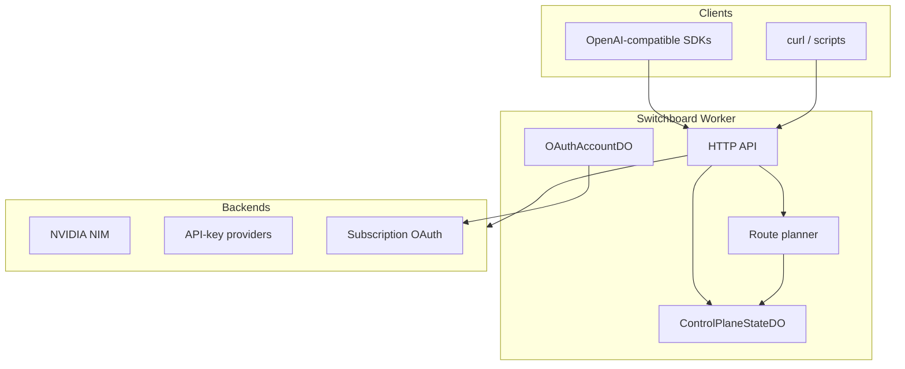
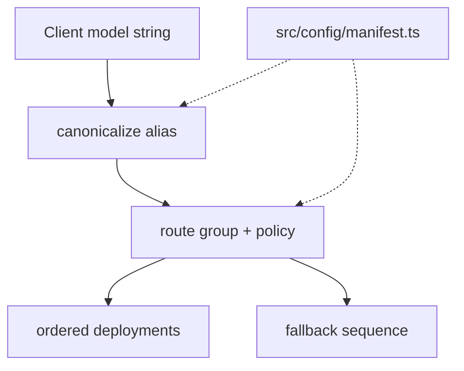
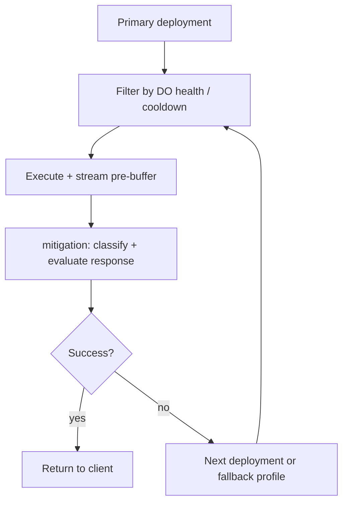
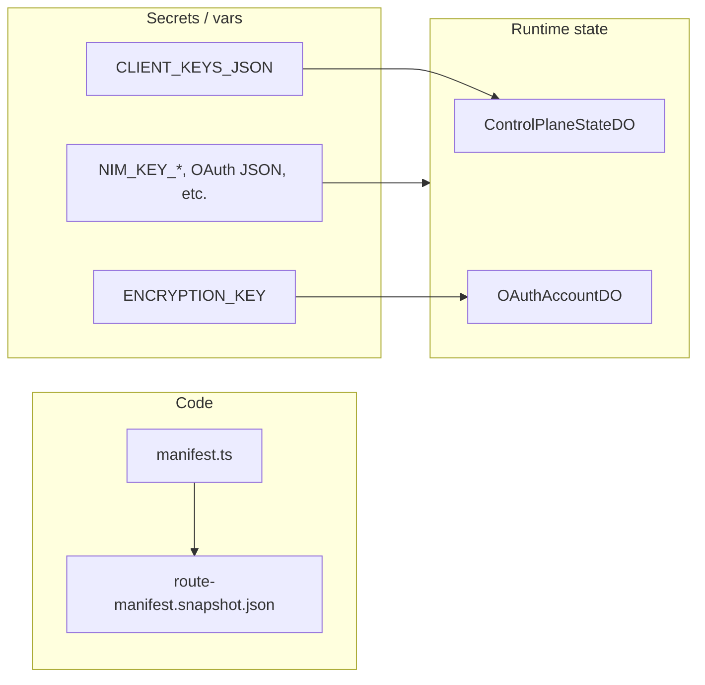
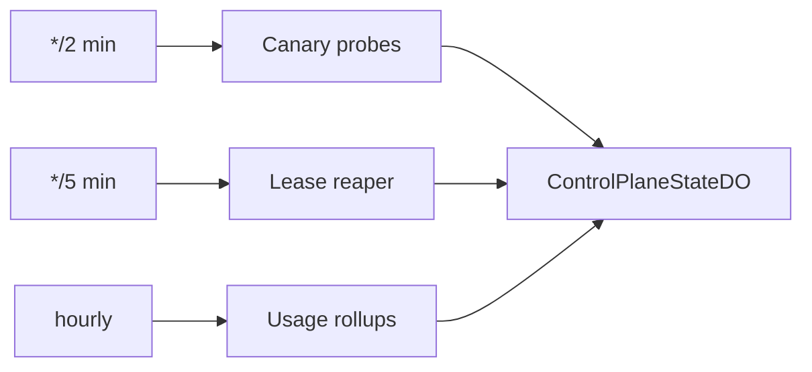
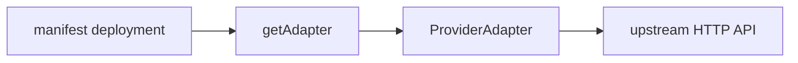

# Switchboard

**Cloudflare Worker LLM router** with OpenAI-compatible routing, silent failover, admission control, and response mitigation.

Point any OpenAI SDK at Switchboard’s base URL. Switchboard authenticates the client, picks a healthy backend from the route manifest, retries and fails over on errors, and returns a normal OpenAI-shaped response with tracing headers.

This repo deploys as **`llm-control-plane`** with secrets `CLIENT_KEYS_JSON`, `ADMIN_API_KEY`, and `/nim/*` operator routes — see [docs/deploy-cutover.md](docs/deploy-cutover.md).

---

## Overview

Switchboard runs on **Cloudflare Workers** with two **Durable Objects** for shared state: routing, health scoring, rate limits, provider execution, and operator APIs—not a local model runtime.

Typical users:

- **Application teams** that want one stable `OPENAI_BASE_URL` across NVIDIA NIM, API-key providers, and subscription OAuth backends.
- **Operators** who edit routing in code, rotate provider secrets via Wrangler, and inspect receipts, usage, and health through admin endpoints.

---

## Capabilities

| Area | What Switchboard does |
|------|------------------------|
| **Routing** | Model aliases, route groups, ordered deployments, profile-specific fallbacks (`general`, `context_window`, `content_policy`), smart-route complexity tiering |
| **Reliability** | Silent failover, transport/semantic retries, optional request hedging, stream pre-buffer + stream evaluation, deployment health scoring and circuits |
| **Admission** | Per-client and per-team RPM, concurrency, and token budgets; per-deployment RPM/parallel limits; learned concurrency; lease reaper (cron) |
| **Mitigation** | Classify provider/stream failures; evaluate responses; repair tool calls (including schema-aware), repetition, reasoning leaks, special tokens, typed content parts |
| **Providers** | NVIDIA NIM, OpenAI-compatible APIs, Anthropic subscription (OAuth), ChatGPT Responses API (OAuth account pool) |
| **Observability** | Request receipts, query-event capture, canary probes, `/nim/failures`, usage rollups with heuristic `estimated_cost_usd` (JSON or `?format=csv`) |
| **Operator APIs** | Admin health/receipts/usage/simulate/cooldowns; operator health + failure query; route manifest validation and snapshot drift checks |

Policy shapes and examples are in [Policy and limits](#policy-and-limits) below. Live defaults and profiles: [`src/config/manifest.ts`](src/config/manifest.ts).

---

## How it works

### System context

Clients use standard OpenAI HTTP paths. The Worker plans each request, consults durable state, and calls provider adapters.



### Request sequence

One `POST /v1/chat/completions` from authentication through receipt storage:

```mermaid
sequenceDiagram
  participant Client
  participant Worker as index.ts
  participant Handler as handler.ts
  participant Planner as planner.ts
  participant DO as ControlPlaneStateDO
  participant Loop as attempt-loop
  participant Provider as provider adapter
  participant Mitigate as mitigation

  Client->>Worker: POST /v1/chat/completions
  Worker->>Worker: authenticate CLIENT_KEYS_JSON
  Worker->>Handler: handleChatCompletions
  Handler->>Planner: planRequest
  Planner-->>Handler: ExecutionPlan
  Handler->>DO: admitClientRequest
  Handler->>Loop: executeAttemptLoop
  loop each deployment
    Loop->>DO: health / admit deployment
    Loop->>Provider: execute or stream
    Provider-->>Loop: response
    Loop->>Mitigate: evaluate / repair
    alt failure
      Loop->>Loop: fallback profile / next deployment
    end
  end
  Handler->>DO: record usage, store receipt
  Handler-->>Client: OpenAI JSON + X-Request-Id headers
```

### Routing

The client sends a **model string** (often an alias). The planner resolves it against the route manifest and produces an ordered list of deployments plus fallbacks.



### Attempt loop and failover

Each deployment is tried in order. Health filters and cooldowns from `ControlPlaneStateDO` can skip unhealthy targets. Failures advance the sequence or promote profile-specific fallbacks (`general`, `context_window`, `content_policy`).



### Configuration layers

Operators change **code** (manifest), **secrets** (Wrangler / [local secrets dir](docs/local-secrets.md)), and rely on **runtime state** in Durable Objects.



### Background jobs

Scheduled handlers in `src/index.ts` keep health and usage data fresh:



---

## Terminology

| Term | Meaning |
|------|---------|
| **Switchboard** | Product name and npm package; Worker deploys as **`llm-control-plane`** (see `wrangler.jsonc`) |
| **Route manifest** | `src/config/manifest.ts` — aliases, route groups, deployments, policies |
| **Route group** | Logical lane id (e.g. `nim-primary`, `smart-route-worker`) — not the same as `provider` |
| **Alias** | Client-visible model string → canonical route group (e.g. `glm-5.1` → `nim-primary`) |
| **`deployment.provider`** | Backend family: `nim`, `openai_compat`, `chatgpt_subscription`, `anthropic_subscription` |
| **`deployment.surface`** | Provider protocol for adapter selection; only `chatgpt_subscription` sets `surface: "responses"` |
| **`deployment.model`** | Catalog / routing label in health and receipts |
| **`deployment.providerModel`** | Model id sent to the upstream API |
| **`deployment.apiBase`** | Upstream HTTP base URL for the provider |
| **Response mitigation** (`src/mitigation/`) | Classify failures, evaluate responses, repair tool calls / repetition / bad output — not the `nim` provider |
| **`nim` provider** | NVIDIA NIM OpenAI-compatible API (`NIM_KEY_*`); route groups may still be named `nim-*` |
| **Manifest snapshot** | `config/route-manifest.snapshot.json` — frozen copy for drift checks (`pnpm snapshot`) |
| **`pnpm dev`** | Local Miniflare via `wrangler dev` (not a second Cloudflare Worker) |

---

## Provider adapters

Each **deployment** in the manifest sets a `provider` type. The attempt loop resolves it through [`src/providers/registry.ts`](src/providers/registry.ts) via `getAdapter(provider, surface)`.



| Provider type | Adapter | Upstream | Client surface | Secrets / auth |
|---------------|---------|----------|----------------|----------------|
| `nim` | `nimAdapter` | NVIDIA NIM OpenAI-compatible `/chat/completions` | Chat completions | `NIM_KEY_*` via `keyRef` |
| `openai_compat` | `openaiCompatAdapter` | Any OpenAI-compatible host (`deployment.apiBase`) | Chat completions | Per-deployment `keyRef` (e.g. `ZAI_KEY_1`) |
| `anthropic_subscription` | `anthropicSubscriptionAdapter` | Anthropic Messages API | Chat completions (normalized to OpenAI JSON/SSE) | OAuth via `OAuthAccountDO` + `ANTHROPIC_*` env |
| `chatgpt_subscription` | `chatgptSubscriptionAdapter` | ChatGPT Responses API | **`POST /v1/responses` only** (`deployment.surface: "responses"`) | `CHATGPT_AUTH_JSON` / account pool |

**Behavior notes**

- **`nim` and `openai_compat`** share the same request builder ([`src/providers/base.ts`](src/providers/base.ts)): `POST {apiBase}/chat/completions`, pass-through OpenAI response shape, no stream wrapping.
- **`anthropic_subscription`** refreshes OAuth tokens, supports multi-account credential rotation ([`src/credentials/`](src/credentials/)), and converts Anthropic output to OpenAI format (`needsStreamWrapping: true`).
- **`chatgpt_subscription`** requires `surface === "responses"` on the deployment; `getAdapter("chatgpt_subscription")` without `surface` throws. Uses [`src/providers/chatgpt-responses.ts`](src/providers/chatgpt-responses.ts) and ChatGPT-specific failure classification.

Implementation files:

| File | Role |
|------|------|
| [`src/providers/adapter.ts`](src/providers/adapter.ts) | `ProviderAdapter` interface |
| [`src/providers/registry.ts`](src/providers/registry.ts) | Type → adapter map |
| [`src/providers/adapters/nim.ts`](src/providers/adapters/nim.ts) | NIM + generic OpenAI-compat |
| [`src/providers/adapters/anthropic-subscription.ts`](src/providers/adapters/anthropic-subscription.ts) | Anthropic subscription |
| [`src/providers/adapters/chatgpt-responses.ts`](src/providers/adapters/chatgpt-responses.ts) | ChatGPT Responses API |

To add a backend: extend `ProviderType` in [`src/config/schema.ts`](src/config/schema.ts), implement `ProviderAdapter`, register in `registry.ts`, and add deployments to [`src/config/manifest.ts`](src/config/manifest.ts).

### Credential rotation (multi-account / multi-key)

When a deployment resolves **more than one** credential ([`src/credentials/resolve-pool.ts`](src/credentials/resolve-pool.ts)), the attempt loop rotates inside a single admitted attempt before falling back to another deployment:

| Provider | Default strategy | Intent |
|----------|------------------|--------|
| `chatgpt_subscription`, `anthropic_subscription` | `sequential_exhaust` | Use primary subscription first; on 429/402/auth failure, cooldown that account and try the next |
| `nim`, `openai_compat` | `spread` | Spread load across `NIM_KEY_*` (auto-discovered from env when `keyRef` is `NIM_KEY_n`) |

- **Credential cooldowns** are scoped to `cred:<credentialId>` in the state DO (shared across deployments using the same key).
- **Deployment health** is updated only after the credential pool is exhausted (not on the first 429 while siblings remain).
- **Policy overrides**: `policy.credentialRotation` and `policy.credentialRotation.byProvider.<provider>` in [`src/config/schema.ts`](src/config/schema.ts); per-deployment `credentialPool` / `credentialRotation` on [`Deployment`](src/config/schema.ts).
- **Sequential order** across requests is persisted per deployment (`cred-order:<deploymentId>`) when using `sequential_exhaust`.

---

## Quick start (local)

### Prerequisites

- [Node.js](https://nodejs.org/) 18+
- [pnpm](https://pnpm.io/)
- Cloudflare account (only for `pnpm deploy`)

### 1. Install dependencies

```bash
pnpm install
```

### 2. Configure secrets (outside the repo)

Real keys and client policy JSON live in **`../switchboard-local/`** (sibling directory, not committed). See [docs/local-secrets.md](docs/local-secrets.md).

```bash
mkdir -p ../switchboard-local/.secrets
cp .dev.vars.example ../switchboard-local/.dev.vars
chmod 0600 ../switchboard-local/.dev.vars
```

For `wrangler dev`, symlink or copy `.dev.vars` into the repo root (gitignored):

```bash
ln -sf ../switchboard-local/.dev.vars .dev.vars
```

Edit `../switchboard-local/.dev.vars`. At minimum for a smoke test:

| Variable | Purpose |
|----------|---------|
| `CLIENT_KEYS_JSON` | Per-client bearer hashes and `allowedModels` (required for API auth) |
| `NIM_KEY_1` | Credential for NVIDIA NIM routes such as `nim-primary` |
| `ADMIN_API_KEY` | Optional; enables `/admin/*` locally |
| `NIM_HEALTH_TOKEN` | Optional; dedicated token for `/ops/health` (falls back to `ADMIN_API_KEY`) |
| `ENCRYPTION_KEY` | Required for OAuth subscription routes (32+ characters) |

Provider keys depend on which models you call. `smart-route` may need `ZAI_KEY_1`; ChatGPT subscription routes need `CHATGPT_AUTH_JSON` and `ENCRYPTION_KEY`.

### 3. Create a client API key

Authentication uses **SHA-256 of the bearer token**, not the raw token in config.

```bash
# Pick a secret bearer string, then hash it (macOS/Linux):
echo -n 'my-local-dev-token' | shasum -a 256 | awk '{print $1}'
```

Put the hex digest in `CLIENT_KEYS_JSON`. Example (single line in `../switchboard-local/.dev.vars`):

```json
{
  "clients": [
    {
      "id": "local-dev",
      "token_sha256": "REPLACE_WITH_SHA256_HEX",
      "allowedModels": ["smart-route", "nim-primary"]
    }
  ]
}
```

Full shape with teams and limits: [config/client-keys.example.json](config/client-keys.example.json).

Tests and CI load client keys from `config/fixtures/client-keys.ci.json` (synthetic IDs only). For local API calls, put your real client key JSON in `../switchboard-local/.dev.vars` as `CLIENT_KEYS_JSON` (see `config/client-keys.example.json`).

### 4. Validate and run

```bash
pnpm validate
pnpm dev
```

`pnpm dev` runs the **`llm-control-plane`** worker locally (default URL `http://localhost:8787`). Set `ENCRYPTION_KEY` and `SWITCHBOARD_PROVIDER_FIXTURE=true` in your local `.dev.vars` for OAuth routes and provider fixtures.

### 5. Call the API

```bash
export BASE_URL=http://localhost:8787
export TOKEN=my-local-dev-token   # the raw bearer, not the hash

# List models visible to your client
curl -s "$BASE_URL/v1/models" \
  -H "Authorization: Bearer $TOKEN" | jq .

# Chat completion (needs NIM_KEY_1 for nim-primary)
curl -s "$BASE_URL/v1/chat/completions" \
  -H "Authorization: Bearer $TOKEN" \
  -H "Content-Type: application/json" \
  -d '{
    "model": "nim-primary",
    "messages": [{"role": "user", "content": "Say hello in one word."}],
    "max_tokens": 16
  }' | jq .
```

Liveness without auth:

```bash
curl -s "$BASE_URL/ping"
```

---

## Using as an OpenAI client

Set the base URL and API key to match your Switchboard client bearer:

```bash
export OPENAI_BASE_URL=http://localhost:8787/v1
export OPENAI_API_KEY=my-local-dev-token
```

**Python**

```python
from openai import OpenAI

client = OpenAI()  # reads OPENAI_BASE_URL and OPENAI_API_KEY
print(client.chat.completions.create(
    model="nim-primary",
    messages=[{"role": "user", "content": "Hello"}],
    max_tokens=32,
))
```

**JavaScript**

```javascript
import OpenAI from "openai";

const client = new OpenAI();
const res = await client.chat.completions.create({
  model: "nim-primary",
  messages: [{ role: "user", content: "Hello" }],
  max_tokens: 32,
});
console.log(res.choices[0].message.content);
```

**Subscription / Responses API models** must use `POST /v1/responses`, not chat completions. The handler rejects the wrong surface for those routes.

Optional per-user attribution (when `CLIENT_USER_CLAIM_SECRET` is set):

- `X-Switchboard-User-Hash`
- `X-Switchboard-User-Signature` (HMAC-SHA256 over `clientId:appId:userHash`)

---

## HTTP API

| Method | Path | Auth | Purpose |
|--------|------|------|---------|
| `GET` | `/ping` | none | Liveness |
| `POST` | `/v1/chat/completions`, `/chat/completions` | Client bearer | Chat completions (streaming supported) |
| `POST` | `/v1/responses` | Client bearer | OpenAI Responses API surface (subscription models) |
| `GET` | `/v1/models`, `/models` | Client bearer | Models allowed for this client |
| `GET` | `/nim/health` | `NIM_HEALTH_TOKEN` or `ADMIN_API_KEY` | Operator health report |
| `GET` | `/nim/failures`, `/nim/failures/{id}` | same as health | Failed-request query API |
| `GET` | `/admin/health` | `ADMIN_API_KEY` | Admin health view |
| `GET` | `/admin/receipts` | `ADMIN_API_KEY` | Route receipts |
| `GET` | `/admin/client-requests` | `ADMIN_API_KEY` | Client request log |
| `GET` | `/admin/query-events` | `ADMIN_API_KEY` | Captured query events (`incoming`, `post_transform`) |
| `POST` | `/admin/cooldowns/clear` | `ADMIN_API_KEY` | Clear cooldowns (see [Authority model](#authority-model)) |
| `GET` | `/admin/usage` | `ADMIN_API_KEY` | Usage aggregates |
| `POST` | `/admin/canary/trigger` | `ADMIN_API_KEY` | Run canary probes |
| `GET` | `/admin/canary/results` | `ADMIN_API_KEY` | Recent canary results |

Route table source: [src/index.ts](src/index.ts).

**Response headers** (when applicable): `X-Request-Id`, `X-Policy-Id`, `X-Policy-Version`, `X-Route-Version`, and optionally `X-Switchboard-Signature`.

---

## Authority model

Switchboard separates **who may call** from **what may run** and **which secret is used**. Four planes:

| Plane | Authority | Store |
|-------|-----------|--------|
| **Routing catalog** | Compiled `MANIFEST` (+ generated free routes) | Aliases, groups, deployments; `pnpm validate` / `pnpm snapshot` |
| **Client** | Bearer hash + client policy | `CLIENT_KEYS_JSON` |
| **Client / team spend** | RPM, concurrency, token budgets | `ControlPlaneStateDO` client tables |
| **Deployment** | Circuits, deployment cooldown, per-key RPM, token budget scope | `deploymentId` scopes + `key_windows` |
| **Credential** | Rotation order, per-secret cooldown | `cred:{credentialId}`, `cred-order:{deploymentId}` |
| **Subscription OAuth** | Anthropic + ChatGPT session material | `OAuthAccountDO` (encrypted); env is bootstrap only |

### Cooldown scope prefixes

| Scope | Meaning |
|-------|---------|
| `{deploymentId}` | Deployment-level cooldown (routing / health) |
| `cred:{credentialId}` | Credential rotation cooldown (API key label or OAuth account id) |
| `cred-order:{deploymentId}` | Persisted sequential-exhaust pool order |

`/admin/health` and `/ops/health` return `deploymentCooldowns` and `credentialCooldowns` partitions plus a flat `cooldowns` map for backward compatibility.

### Admin cooldown clear

`POST /admin/cooldowns/clear` query parameters:

| Parameter | Effect |
|-----------|--------|
| *(none)* | Clear all cooldown rows |
| `deployment_id` | Clear deployment scope + `cred-order:{deploymentId}` |
| `deployment_id` + `include_credentials=true` | Also clear every `cred:*` id from the deployment manifest pool plus auto-discovered `NIM_KEY_*` env bindings when present |
| `credential_id` | Clear `cred:{credential_id}` only |

### Token and RPM budget scope

Manifest `policy.budget.scopeMode` controls whether RPM and token windows are keyed per deployment key (`per_key` → `{group}:{keyRef}`) or shared across a route group (`global` → `{group}:global`). Admission, pre-routing filter, and `recordTokenUsage` all use the same key function ([`src/config/budget-keys.ts`](src/config/budget-keys.ts)).

When **credential rotation** is active (`pool.length > 1` and DO cooldown RPCs available), per-key RPM and token budget are **checked** at admit time on the deployment’s manifest `keyRef` but **enforced/charged** at dispatch on the credential actually used (including each rotation attempt). Token usage is always recorded on the active credential key after a successful response.

**Credential pool exhaustion** (all rotation slots cooled down or failed) records an `exhausted` attempt and retries fallbacks; it does **not** call `recordFailure` on the deployment, so circuits stay closed for credential-only outages.

`billingClass` / `freeTier` on deployments and receipts are **observability and cost heuristics only** — client admission still uses `allowedModels`, `deniedModels`, and `deniedRouteGroups` from `CLIENT_KEYS_JSON`. A `smart-route` request that falls back to NIM will show `billing_class: free` and `free_tier: nim_api` on the receipt for the deployment that actually served the response.

**Streaming** uses the same credential rotation path as non-streaming when multi-key rotation is enabled (OAuth/API-key pools with DO health). Single-credential deployments still use one upstream connection per attempt.

Ops health and alias visibility use `runtimeCredentialIds()` so auto-discovered numbered API keys (`NIM_KEY_*`, `OPENROUTER_API_KEY_*`, `GROQ_API_KEY_*`, …) participate in `credential_pool_exhausted` pre-checks when Worker `env` is available.

#### Multi-key API credentials

| Layer | Convention |
|-------|------------|
| **Runtime (production)** | Numbered env vars per provider: `OPENROUTER_API_KEY_1`, `GROQ_API_KEY_2`, `NIM_KEY_1`, … — each key is a separate rotatable identity with its own cooldown |
| **Local dev bootstrap** | Optional `OPENROUTER_API_KEYS=sk-a,sk-b` (comma-separated) expands into synthetic per-key slots at pool-resolve time; not a single rotatable blob |

Do not use one comma-separated production secret: it breaks per-key cooldowns, spread rotation, and ops clear-by-credential.

### Edge IP rate limit

Proxy routes (`/v1/models`, `/v1/chat/completions`, `/v1/responses`) call an **isolate-local** IP limiter before client authentication (to shed abusive traffic early). Models list and inference use separate per-IP buckets ([`src/security/rate-limit.ts`](src/security/rate-limit.ts)). This smooths abuse per edge isolate; it is **not** a global cap. Set `SWITCHBOARD_IP_RATE_LIMIT_ENABLED=false` to disable. For strict global limits, use DO/KV state (future work).

### ChatGPT vs Anthropic subscription storage

Both providers store OAuth/session material in `OAuthAccountDO`. ChatGPT uses provider id `chatgpt_subscription` and DO name `chatgpt-subscription`; Anthropic uses `anthropic_subscription`. On first read, structured auth JSON from env (`CHATGPT_AUTH_JSON`, account labels, etc.) is encrypted into the DO once (lazy seed). Token refresh updates the DO via `refreshChatGPTSubscriptionAuthMaterial`.

---

## Policy and limits

Switchboard uses two separate policy layers. Do not confuse them.

| Layer | Where | Keyed by | Controls |
|-------|--------|----------|----------|
| **Client admission** | `CLIENT_KEYS_JSON` secret | Client `id` (+ optional `teamId`) | Auth, model allow/deny lists, OAuth model visibility, RPM / concurrency / token budgets |
| **Route execution** | [`src/config/manifest.ts`](src/config/manifest.ts) | **Route group id** (e.g. `nim-primary`) | Request gates, response mitigation, timeouts, retries/hedge, circuits, deployment budget scope |

Client `policyId` is **metadata only** (receipts, headers, admin queries). It does **not** select a manifest policy. Execution policy is `MANIFEST.policies[routeGroup]` with fallback to `defaultPolicy`.

### Client admission policy

Loaded from `CLIENT_KEYS_JSON` at request time ([`src/http/client-policy.ts`](src/http/client-policy.ts)). Invalid or empty config fails closed (401).

Full template: [config/client-keys.example.json](config/client-keys.example.json).

```json
{
  "teams": {
    "engineering": {
      "rpmLimit": 500,
      "maxConcurrency": 20,
      "tokenBudgetPerMinute": 500000
    }
  },
  "clients": [
    {
      "id": "my-client-id",
      "appId": "my-app",
      "token_sha256": "<sha256-hex-of-bearer-token>",
      "policyId": "my-policy",
      "teamId": "engineering",
      "allowedModels": ["smart-route", "nim-primary"],
      "deniedModels": [],
      "deniedRouteGroups": [],
      "rpmLimit": 60,
      "maxConcurrency": 4,
      "tokenBudgetPerMinute": 120000,
      "oauthExcludedModels": {
        "anthropic": ["claude-3-5-haiku-20241022"]
      }
    }
  ]
}
```

| Field | Purpose |
|-------|---------|
| `token_sha256` | SHA-256 hex of the bearer token (lowercase) |
| `allowedModels` / `deniedModels` | Model alias allow/deny |
| `deniedRouteGroups` | Block canonical route group ids |
| `oauthExcludedModels` | Per-provider model ids hidden from `/v1/models` (merged with manifest `oauthExcludedModels`) |
| `rpmLimit`, `maxConcurrency`, `tokenBudgetPerMinute` | Client-level admission (override team defaults where set) |
| `teamId` | Inherit team `rpmLimit` / `maxConcurrency` / `tokenBudgetPerMinute` |

For `pnpm live:smoke` against a deployed URL, set **`SWITCHBOARD_URL`** and **`SWITCHBOARD_CLIENT_BEARER`** (raw bearer matching a configured `token_sha256`).

### Route execution policy (manifest)

Type definition: [`src/config/schema.ts`](src/config/schema.ts) (`Policy`). Defaults and named profiles: top of [`src/config/manifest.ts`](src/config/manifest.ts).

Each route group id in `MANIFEST.policies` gets a composed `Policy`. Build with `composePolicy(profileNames, overlay)` over `DEFAULT_POLICY` and `POLICY_PROFILES`:

| Profile | Typical use |
|---------|-------------|
| `reasoning-enabled` | Allow reasoning fields on chat routes |
| `nim-openai-chat` | NIM chat: stricter unsupported params, shorter deadlines, hedging enabled |
| `nim-tool-primary` | Tool lanes: non-streaming tools only |
| `chatgpt-responses` | Responses API surface and operations only |
| `anthropic-messages` | Anthropic OAuth chat with multimodal |

**Default policy (abbreviated)** — see `DEFAULT_POLICY` in manifest for full values:

```typescript
{
  request: {
    unsupportedParams: ["logit_bias", "logprobs", "stream_options", /* … */],
    supportedSurfaces: ["chat_completions"],
    supportedOperations: ["chat", "chat_stream", "tool", "tool_stream", /* … */],
    allowedContentClasses: ["empty", "text", "tool_result"],
    rejectStreamingTools: false,
    stripReasoningFromSuccess: true,
    minRequestTokens: 512,
    maxRequestTokens: null,
    enableReasoning: false,
  },
  response: {
    enableSemanticValidation: true,
    enableToolRepair: true,
    enableRepetitionDetection: true,
    repetitionMaxRatio: 0.4,
    enableSchemaAwareRepair: false,
    repairPolicy: { allowDestructiveByDefault: false, /* toolNameAliases, … */ },
  },
  deadline: {
    attemptTimeoutSeconds: 120,
    firstTokenTimeoutSeconds: 15,
    streamIdleTimeoutSeconds: 30,
    totalTimeoutSeconds: 300,
  },
  retry: {
    transportRetries: 1,
    semanticRetries: 1,
    retryableFailureClasses: ["transport_error", "server_5xx", "semantic_failure", /* … */],
    backoffBaseMs: 250,
    backoffMaxMs: 2000,
    hedge: { enabled: false, maxCandidates: 1, onlyWhenSuspect: true, hedgeDelayMs: 0 },
  },
  health: {
    circuitFailureThreshold: 5,
    circuitDurationSeconds: 300,
    transportCooldownSeconds: 90,
    halfOpenPenalty: 2.5,
    /* latency EMA, suspect thresholds, … */
  },
  budget: {
    scopeMode: "per_key",
    learnedConcurrencyEnabled: true,
    rpmLimit: null,
    maxParallelRequests: null,
    tokenBudgetPerMinute: null,
  },
}
```

**Compose a route-group policy** (pattern used for `nim-primary`, ChatGPT, Anthropic groups):

```typescript
// One profile + small overlay
"nim-primary": composePolicy(["nim-openai-chat"], {
  request: { maxRequestTokens: 32000 },
}),

// NIM tool lane: chat profile + tool restrictions + hedging from nim-openai-chat
"nim-tool-primary": composePolicy(["nim-openai-chat", "nim-tool-primary"]),
```

**Route group routing** (separate from `Policy`, same manifest) — fallbacks and planner hooks:

```typescript
"nim-primary": {
  target: "nim-primary",
  hidden: false,
  fallbacks: ["nim-deepseek-v4-pro", "nim-kimi-k2.5", /* … */],
  fallbackByProfile: {
    context_window: ["zai-glm-5.1-terminal-fallback", "nim-deepseek-v4-pro"],
    general: ["nim-deepseek-v4-pro", "nim-kimi-k2.5", /* … */],
    content_policy: ["nim-secondary", "zai-glm-5.1-terminal-fallback"],
  },
},
"smart-route-worker": {
  target: "zai-glm-5.1",
  fallbacks: ["nim-primary", /* … */],
  planner: { toolGroup: "nim-tool-primary", strictToolGroup: "nim-tool-primary" },
},
```

`failureClass` from the attempt loop maps to a fallback profile (e.g. `context_length_exceeded` → `context_window`). See [`src/config/fallback-profile.ts`](src/config/fallback-profile.ts).

**Per-deployment knobs** (not the `Policy` object): `rpm`, `maxParallelRequests`, `timeout`, `capabilities`, `cooldownProfile`, `accountIds` (OAuth rotation), `surface` for ChatGPT Responses.

### Routing manifest workflow

- Defines aliases → route groups → deployments and the `policies` map above.
- Validated at Worker boot and via `pnpm validate`.
- After edits, refresh the audited snapshot: `pnpm snapshot` → [config/route-manifest.snapshot.json](config/route-manifest.snapshot.json).

---

## Configuration

### Client keys (`CLIENT_KEYS_JSON`)

See [Client admission policy](#client-admission-policy) for fields and example JSON.

### Routing (`src/config/manifest.ts`)

See [Route execution policy](#route-execution-policy-manifest) and [Routing manifest workflow](#routing-manifest-workflow).

### Provider secrets

See [.dev.vars.example](.dev.vars.example). Grouped by need:

| Group | Examples | When required |
|-------|----------|----------------|
| NVIDIA NIM | `NIM_KEY_1` … `NIM_KEY_9` | Routes under `nim-*` groups |
| Z.AI | `ZAI_KEY_1` | `smart-route` / ZAI deployments |
| ChatGPT subscription | `CHATGPT_AUTH_JSON`, `CHATGPT_AUTH_ACCOUNTS` | ChatGPT subscription route groups |
| Anthropic subscription | `ANTHROPIC_OAUTH_ACCOUNT`, `ANTHROPIC_CLIENT_ID`, `ANTHROPIC_CLIENT_SECRET` | Anthropic OAuth routes |
| Crypto | `ENCRYPTION_KEY` (32+ chars) | OAuth token storage in `OAuthAccountDO` |

Set production secrets with `wrangler secret put NAME` (see [wrangler.jsonc](wrangler.jsonc)).

### Worker types

```bash
pnpm types:worker        # write worker-configuration.d.ts
pnpm types:worker:check  # CI drift check
```

### Provider fixtures (local / smoke)

Mock upstream provider HTTP is served on the **same** Worker when `SWITCHBOARD_PROVIDER_FIXTURE=true`:

- Paths: `/__fixture/v1/chat/completions`, `/__fixture/v1/responses`, `/__fixture/v1/messages`
- Point provider traffic: `PROVIDER_API_BASE_ALL=http://127.0.0.1:8787/__fixture/v1` in `.dev.vars`
- Disabled by default in production (returns 404 unless the env flag is set)

---

## Development and deploy

| Command | Description |
|---------|-------------|
| `pnpm dev` | Local Worker (`wrangler dev` + [wrangler.jsonc](wrangler.jsonc)) |
| `pnpm test` | Vitest + Workers pool |
| `pnpm test:watch` | Watch mode |
| `pnpm tsc` | Typecheck |
| `pnpm validate` | Secret permissions + types + manifest |
| `pnpm snapshot` | Update route manifest snapshot |
| `pnpm sync-free-models` | Probe free catalogs, write suggestions JSON, regenerate `free-routes.generated.ts` |
| `pnpm generate-free-routes` | Regenerate `free-routes.generated.ts` from committed suggestions JSON |

### Free vs subscription routes

| Client alias | `billingClass` | Backends |
|--------------|----------------|----------|
| `free`, `freemium` (compat), per-model free ids | `free` | **Kilo AI Gateway** (`api.kilo.ai`), **OpenCode Zen** (`opencode.ai/zen/v1`, keyless where probed), OpenRouter $0 + Groq (when API keys set at sync), NIM $0 groups as fallbacks |
| `smart-route`, `gpt-*`, `claude-*`, `nim-*` (direct) | `subscription` or `free` (NIM) | Z.ai GLM, ChatGPT/Claude OAuth, existing NIM lanes |

**Kilocode** here means the hosted **Kilo Gateway** API, not the IDE-only config. **OpenCode Zen** is the hosted Zen endpoint, not a local `127.0.0.1:4096` agent. `freeTier` on deployments/receipts is observability only (catalog $0, rate-limited Groq, NIM, gateway, Zen) — routing still uses the single `free` multiplex.

| Command | Purpose |
|---------|---------|
| `pnpm bundle-size` | Worker bundle size check (CI) |
| `pnpm deploy` | Deploy remote Worker `llm-control-plane` (`wrangler deploy`) |
| `pnpm live:smoke` | HTTP smoke against a deployed URL (`SWITCHBOARD_URL`, `SWITCHBOARD_CLIENT_BEARER`) |
| `pnpm failures` | Failure inspection helper |

**Production deploy (outline)**

```bash
pnpm validate
wrangler secret put CLIENT_KEYS_JSON
wrangler secret put NIM_KEY_1
# ... other secrets ...
pnpm deploy
```

---

## Observability

- **Receipts** — Per-request routing decisions stored in `ControlPlaneStateDO`; query via `/admin/receipts`.
- **Query events** — Opt-in capture for debugging; `GET /admin/query-events`. Set `SWITCHBOARD_QUERY_CAPTURE_ENABLED=true` or `SWITCHBOARD_QUERY_CAPTURE_TIER=shape|redacted|raw` (raw also needs `SWITCHBOARD_QUERY_CAPTURE_RAW_ENABLED=true` and a key). Cap per request with `QUERY_CAPTURE_MAX_EVENTS` / `SWITCHBOARD_QUERY_CAPTURE_MAX_EVENTS` (default **50**).
- **Failures** — Failed-request records; list/query via `/nim/failures` and `/nim/failures/{id}` (`NIM_HEALTH_TOKEN` or `ADMIN_API_KEY`).
- **Usage** — `/admin/usage` aggregates token usage. JSON responses include `cost_estimate_source: "heuristic"` alongside `totals`/`byGroup`; `?format=csv` includes heuristic `estimated_cost_usd` ([`src/config/usage-pricing.ts`](src/config/usage-pricing.ts)).
- **Canaries** — Cron probes every 2 minutes; trigger manually with `/admin/canary/trigger`.
- **Tracing** — Use `X-Request-Id` (and optional `X-Switchboard-Signature` when enabled) to correlate logs and admin queries.
- **Health** — `/nim/health` exposes route-group status, circuits, and planner settings.

---

## Repository layout

```
src/
  index.ts              # Worker entry: routes, CORS, crons
  http/                 # handler, validation, client-policy, auth
  planner/              # canonicalize, plan, deployment filters, smart-route
  attempts/             # attempt-loop, fallback-sequence
  providers/            # registry, base HTTP, adapters/
    adapters/           # nim, openai-compat, anthropic, chatgpt-subscription
  mitigation/           # classify, evaluate, repair (response mitigation)
  state/                # ControlPlaneStateDO, OAuthAccountDO
  config/               # manifest, schema, validate-manifest
  observability/        # receipts, query-events, token usage, logging
  probes/               # health endpoint, canaries
config/
  client-keys.example.json
  route-manifest.snapshot.json
scripts/                # validate-manifest, live-smoke, failures, …
```

---

## Troubleshooting

| Symptom | What to check |
|---------|----------------|
| Worker fails to start | Run `pnpm validate`; fix manifest errors reported at boot |
| `401 unauthorized` on API routes | Bearer present; `token_sha256` in `CLIENT_KEYS_JSON` is SHA-256 **hex** of that bearer (lowercase) |
| `403` / model denied | Model in client `allowedModels`; not in `deniedModels` / `deniedRouteGroups`; OAuth exclusions |
| Provider errors / empty completions | Matching provider key in `.dev.vars` for the route group (e.g. `NIM_KEY_1` for `nim-primary`) |
| Subscription model rejected on chat | Use `POST /v1/responses` instead of chat completions |
| `chatgpt_subscription requires surface='responses'` | Route uses `provider: chatgpt_subscription`; client must call `/v1/responses`, deployment must set `surface: "responses"` |
| OAuth routes fail | `ENCRYPTION_KEY` set; valid `CHATGPT_AUTH_JSON` or Anthropic OAuth env |
| `live:smoke` skips authenticated probes | Set `SWITCHBOARD_URL` and `SWITCHBOARD_CLIENT_BEARER` matching deployed client keys |
| CI manifest drift | Run `pnpm snapshot` after editing `src/config/manifest.ts` |

---

## Further reading

- [src/config/manifest.ts](src/config/manifest.ts) — live routing configuration, `DEFAULT_POLICY`, `POLICY_PROFILES`
- [src/config/schema.ts](src/config/schema.ts) — `Policy`, `Deployment`, `RouteGroup` types
- [src/providers/registry.ts](src/providers/registry.ts) — provider adapter registry
- [config/client-keys.example.json](config/client-keys.example.json) — client admission policy template
- [config/route-manifest.snapshot.json](config/route-manifest.snapshot.json) — audited routing snapshot
- [docs/deploy-cutover.md](docs/deploy-cutover.md) — upgrading from pre-rename deployments (env aliases, crons, ops URLs)
